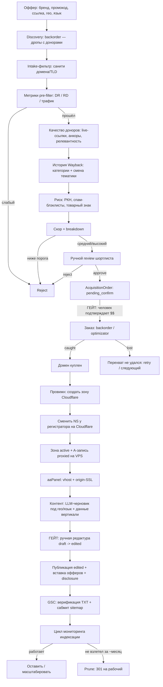

# PIPELINE — логическая цепочка, состояния, гейты

Полный цикл: от описанного оффера до опубликованного и мониторимого сайта.
Два человеческих гейта (подтверждение выкупа, редактура контента) обязательны.

## Диаграмма

## Состояния (state machine)
- **Domain.status:** discovered → scored → approved | rejected → purchasing → purchased → (dropped)
- **AcquisitionOrder.status:** pending_confirm → ordered → caught | failed
- **Site.status:** provisioning → content → published → monitoring → pruned
- **Page.status:** draft → **edited** → published

## Кто триггерит переход (человек vs авто)
| Переход | Триггер |
|---|---|
| discovered → scored | авто (scoring) |
| scored → approved/rejected | **человек** смотрит шортлист (авто-reject для грязных/РКН) |
| approved → order(pending_confirm) | авто |
| pending_confirm → ordered | **человек подтверждает** (гейт выкупа, деньги) |
| ordered → caught/failed | авто (поллинг провайдера) |
| caught → purchased + Site(provisioning) | авто |
| провижн (зона→NS→DNS→vhost→SSL) | авто, идемпотентно |
| content: draft | авто (LLM) |
| draft → edited | **человек** (гейт редактуры) |
| edited → published | авто |
| мониторинг, prune-предложение | авто; сам prune/301 — с подтверждения |

## Нюансы и пути отказа (не забыть в реализации)
- **Backorder — это ставка, не гарантия.** Перехват дропа может не удаться (конкуренция). Обрабатывать `failed`, решать retry/следующий. Ценные дропы → backorder (ставка); уже свободные чистые домены → optimizator (гарантированно).
- **Шаг NS обязателен и асинхронен.** После создания зоны Cloudflare отдаёт свои NS — их надо прописать у регистратора (.ru: reg.ru/nic.ru API), затем дождаться `active` зоны и пропагации. Только потом DNS-записи. Пропуск = сайт не резолвится.
- **SSL full (strict).** Cloudflare даёт edge-SSL; для strict нужен валидный origin-cert (aaPanel Let's Encrypt или CF Origin Cert). Иначе — редирект-петли/ошибки SSL.
- **Идемпотентность провижна.** Хранить `cf_zone_id`/`aapanel_site_name` и проверять-перед-созданием: повторный прогон не должен плодить зоны/сайты.
- **Локализация.** Оффер несёт country+language. Решить: один домен = одно гео/язык (чище) или мультиязычный сайт. Контент генерится под целевые гео/язык оффера.
- **Стоимость и квоты.** Метрики (плата по строкам!), Wayback (тяжесть/вежливость), GSC URL Inspection (лимит ~сутки), LLM-токены. Кэшировать, батчить, backoff.
- **Комплаенс.** Affiliate-disclosure на страницах; ToS партнёрок (часть банит тонкие/инцентив сайты); товарный знак в домене — юр-риск.
